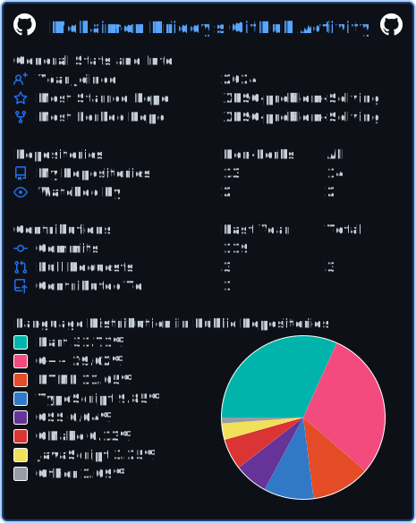
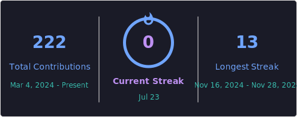

<h1 align="center">
  
</h1>

  
  &nbsp;
  

  <a href="https://mohaimenhridoy.vercel.app/" target="_blank"><code>🌐 Portfolio</code></a> &nbsp;
  <a href="https://github.com/Mohaimen-Hridoy" target="_blank"><code>💻 GitHub</code></a> &nbsp;
  <a href="mailto:mohaimenhridoy@gmail.com"><code>📫 Email</code></a>

---

<h2 align="center">🧑‍💻 About Me</h2>

  I'm a <b>Computer Science &amp; Engineering</b> student at <b>MIST</b>, Bangladesh, focused on fullstack development. 
  I enjoy turning ideas into working products — from mobile apps to personal web projects.

- 🔭 Currently working on **Jolshiri Smart City** — a Flutter-based mobile app
- 🌱 Currently deepening my skills in **Full-Stack Web Development** (React, Node.js, TypeScript)
- 🧩 I love **Problem Solving** and **Competitive Programming** in **C++**
- 💬 Ask me about anything web dev related, happy to help
- 📫 Reach me at **mohaimenhridoy@gmail.com**
- ⚡ Fun fact: *I turn caffeine into code ☕ → 💻*

---

<h2 align="center">🛠️ Tech Stack</h2>

  

---

<h2 align="center">📌 Featured Projects</h2>

| Project | Description | Stack |
| --- | --- | --- |
| Jolshiri Smart City | Smart city mobile app with a custom UI | Flutter, Dart |
| [Portfolio Website](https://mohaimenhridoy.vercel.app/) | Personal portfolio with animations | Vite, JavaScript |
| [devpulse](https://github.com/Mohaimen-Hridoy/devpulse) | Developer-focused project | TypeScript |
| [XPSC Problem Solving](https://github.com/Mohaimen-Hridoy/XPSC-problem-Solving) | Problem solving practice | C++ |
| [Assignments](https://github.com/Mohaimen-Hridoy/Assignments) | Academic assignments repo | TypeScript |

---

<h2 align="center">📊 GitHub Stats</h2>

  

  

  

---

<h2 align="center">🐍 Contribution Snake</h2>

  

---

<i>⭐️ From <a href="https://github.com/Mohaimen-Hridoy">Mohaimen-Hridoy</a></i>

